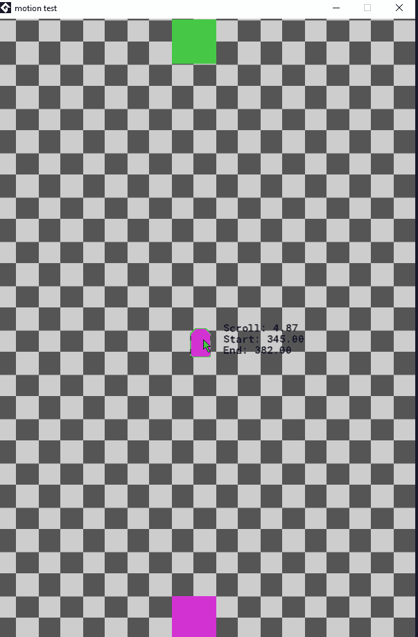

# Motion Test

## Current scope
- Simple GameMaker Studio 2024 project that lives in `motion test.yyp`, so the repo is already wired to build/export from GameMaker.
- `Room1` is the only room right now; it lays down a tiled background using `Sprite3` and instantiates a single `player_obj` in the `Instances` layer.
- `player_obj` is a physics-enabled square (`Sprite1`) with a Step event that interpolates toward the mouse cursor while aligning its `image_angle` with the direction of travel, demonstrating smooth pursuit motion.

Add more sprites, rooms, or interactions to expand this motion test and capture new gifs for the README as you evolve the demo.
